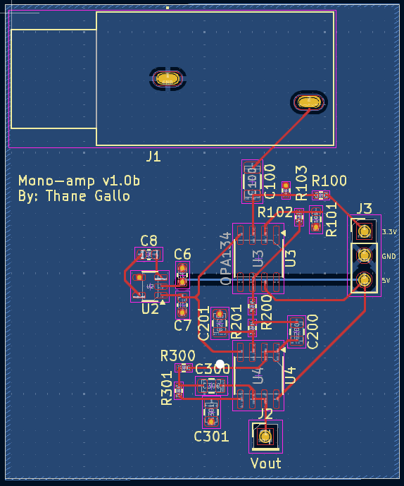
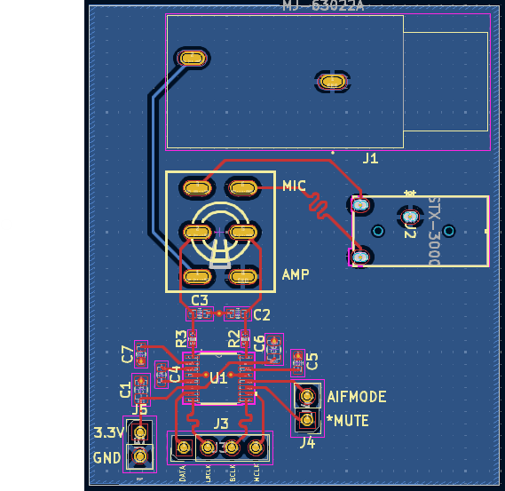

# Hardware Design

## Table of Contents
* [Part Selection](#Part-Selection)
* [Development](#Development)
* [Roadbumps](#Roadbumps)
* [Conclusion / Future Design Changes](#Conclusion--Future-Design-cChanges)

## Part Selection

### Op-Amp
 I chose the [OPAx134](https://www.ti.com/lit/ds/symlink/opa134.pdf) Op-amp as it boasts very small noise characterestics around the audio range that would be able to be heard by the human ear (0Hz - 20kHz) 
 
 Although it is a little pricier than the other alternatives I believe it is worth the cost as it gives us a good starting signal into our ADC

### ADC
The chosen ADC was [PCM1802DB](https://www.digikey.com/en/products/filter/data-acquisition/adcs-dacs-special-purpose/768?s=N4IgTCBcDaIIwA4AMYAiAhEBdAvkA)

This was chosen due to the following characteristics:

* Multiple internal filters such as anti-aliasing and high pass filters
* Stereo input (for future board development)
* 96kHz sample rate at max (44.1kHz is standard) to allow for higher fidelity 
* Supports I2S transactions and contains multiple control pins for different internal configurations

### MCU
The chosen MCU was [STM32F44RE](https://www.digikey.com/en/products/detail/stmicroelectronics/NUCLEO-F446RE/5347712?gclsrc=aw.ds&&utm_adgroup=&utm_source=google&utm_medium=cpc&utm_campaign=PMax%20Shopping_Product_Low%20ROAS%20Categories&utm_term=&utm_content=&utm_id=go_cmp-20243063506_adg-_ad-__dev-c_ext-_prd-5347712_sig-CjwKCAjwzMi_BhACEiwAX4YZUPHpk-zHzDov2nI4mvNVZQl9ZMhKRm_qsVS7q0sjmrhjJ651UxK07RoCICAQAvD_BwE&gad_source=1&gbraid=0AAAAADrbLlhzVWufnPiJhrASsS6sFmpfE&gclid=CjwKCAjwzMi_BhACEiwAX4YZUPHpk-zHzDov2nI4mvNVZQl9ZMhKRm_qsVS7q0sjmrhjJ651UxK07RoCICAQAvD_BwE&gclsrc=aw.ds)

This was chosen due to the following characteristics:

* Exists on a readily availible development board 
* High clock speed and FPU support
* Supports all different I2S formats that the ADC/DAC can use
* Used in industry and very user friendly

### DAC
The chosen DAC was [WM8524CGEDT/R](https://www.digikey.com/en/products/detail/cirrus-logic-inc/WM8524CGEDT-R/5036730)

This was chosen because

* I2S Compatable
* Similar sample rate to ADC
* Signle power supply (3.3V)
* No preprocesssing is needed for the output signal aside from a passive filter

# Development 
My plan was to develop each sub-circuit one at a time then integrate. This led to the development of the following sub circuits in this order:

* Op-amp
* ADC breakout board
* DAC breakout board
* MCU

The decision to make breakout boards was made so I would theoretically be able to modularize these components and possibly use them for future projects while also testing the efectiveness of the PCBA design. This did however slow down development as each breakout took approximetely 1 week to fabricate.

My op-amp was designed first as it was the simplest part and could quickly be adjusted as the chip chosen has a dip package as well as a smd package so I would be able to prototype on a breadboard. 

Now that the signal would be within the desired voltage range I began to design the ADC circuit of which I decided to include an anti-aliasing passive filter outside of the layout for the inputs in addition to the reccomended layout just to clean the signal a bit more. This was put together into a breakout board and the layout can be seen below.

As the only high speed signals that needed to be synched on the chip were the lines for the I2S protocol--SCK, SD, and WS--careful consideration was made to keep the trace length as similar as possible to prevent desync issues.

This was tested with a development board MCU so that it was verifed the signals recieved were the correct values and as I do not have a network analyzer either I did this using a large buffer of samples in which I played the freqency of a known note(A4-->440Hz) which then I took the FFT of to see that the frequency response was as expected.

Once this was completed I began the breakout board for the DAC which proceeded similarly to the ADC (Layout can be seen below). Verification of this was done by just passing the signals from the ADC to the DAC and outputting it into a 3mm headphone jack to see if it was the correct note.

The MCU was not be added to the PCB until the very last step as I have the ability to use a development board for my MCU and want to avoid any possible hiccups until later in development.

Finally the system was integrated together and each part was combined in a single PCBA and can be seen below:

# Roadbumps

## Too many "antennas"
I quickly realized that as I create more breakout boards each individual jumper wire would carry the signals and distort them although this was mainly a concern for the analog electronics for signal integrety the grounding system that was set up was less than ideal as it was spread over several long jumpers and not a dedicated plane. 

# Conclusion / Future Design Changes

Possibly downgrade the MCU as it is relatively a higher power option to something cheaper to procure and produce.

PCM1740E/2K appears to be much better but would cost me nearly 500x time amount of the other option
