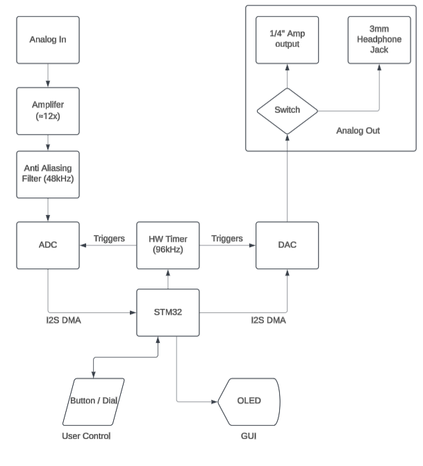

# Abstract 
  A custom reprogrammable guitar pedal using C++ for drivers and digital signal processing to allow for emulation of analog audio circuits.

# Intro 
  This project was began after my other music related project as it sparked an interest in muscial technologies as well as my interest of embedded system design. The original idea was to create an analog pedal however I would want the most functionality with the least amount of effort for the user this led me to the conclusion that I would need a digital system as I would be theoretically able to reprogram, adjust, and add lots of options for use including but not limited to:

  * Delay 
  * Gain 
  * Distortion 
  * Filters
  * Etc

As this system contains custom hardware and software I decided to split up into other files for ease of reading with the links below:

# Table of Contents
* [Skills Utilized](#Skills-Utilized)
* [System Diagram](#System-Diagram)
* [Hardware Design](#Hardware-Design)
* [Software Design](#Software-Design)
* [Known Issues](#Known-Issues)
* [Conclusion](#Conclusion)
* [Acknowledgements](#Acknowledgements)

# Skills Utilized
Hardware:
* KiCAD
* Amplifier and filter design
* Mixed signal circuit design
* Power system design
* 4-Layer-PCB

Software:
* Digital Signal Processing (DSP)
* C++/C
* FreeRTOS
* I2S
* HAL / Device Drivers

# System Diagram

# Hardware Deisgn

1. **Amplify Analog Audio Signal**:  
   The analog audio signal is first amplified to the desired level of **3 V peak-to-peak (Vp-p)**.

2. **Digitize Signal (ADC)**:  
   The amplified analog signal is converted into a digital format using an **Analog-to-Digital Converter (ADC)** for further processing.

3. **Process Signal (STM32F44RE)**:  
   The digitized signal is processed using the **STM32F44RE microcontroller**, which performs necessary filtering, manipulation, and any other DSP tasks.

4. **Convert Signal to Analog (DAC)**:  
   After processing, the signal is converted back to an analog signal using a **Digital-to-Analog Converter (DAC)**.

5. **Output Signal**:  
   The final analog output is sent through either a **3.5mm headphone jack** or a **1/4" amplifier jack** for listening or further amplification.

More in depth information can be found [here](Documentation/Hardware_Design.md)

# Software Design
The high level signal flow for software consists as follows.

1. Amplify analog audio signal to desired level (3Vp-p)
2. Digitize Signal (ADC)
3. Process Signal (STM32F44RE)
4. Convert signal to analog (DAC)
5. Output signal through either 3mm headphone jack or 1/4" amp jack

More in depth information can be found [here](Documentation/Software_Design.md)

# Known Issues
* The filter is not perfectly centered around the 1.5 v value with perfect size to fit the whole adc sampling range there is a calibration feature to be added which would give feedback and tell you to adjust the volume potentiometer on the input guitar. This does not matter on the output as it is renormalized when the data enters the MCU but limits the maximum amount of information to be taken within the ADC.

# Conclusion
A very interesting project overall as it required careful consideration of grounding, crosstalk, and mixed circuitry. It really put into perspective how much of a difference outside sources of noise and their harmonics can damage analog signals From my testing phase where I made multiple breakout boards for each major set of components and utilized lots of jumpers which in essence acted as a large amount of antennas and picked up large amounts of external noise to when the PCB was fabricated and those were replaced by traces in the lengths of the scale of mm. Also since this was my first system that used a 4-layer board I believe I was able to really lock down and eliminiate the EMI from the trace lengths and messy wiring that was avoided.

Also since I had used a very powerful processor it very easily allowed for any of the effects to be layered and for each effect to be used as requested by the user, This would theoretically lead to another MCU chosen in the future which would have less power and would become cheaper to manufacture but this would be for another time and because this is a personal project for me and a few friends this edit is to be omitted.

# Acknowledgements
* [Embedded Media Processing](https://www.analog.com/media/en/dsp-documentation/embedded-media-processing/embedded-media-processing-chapter5.pdf) --> from analog circuit for basic design tips for both software and hardware.
* [How to Achieve Proper Grouding](https://www.youtube.com/live/ySuUZEjARPY?si=K5OwzKmg3GG3vNq2) --> altium conference speaker
